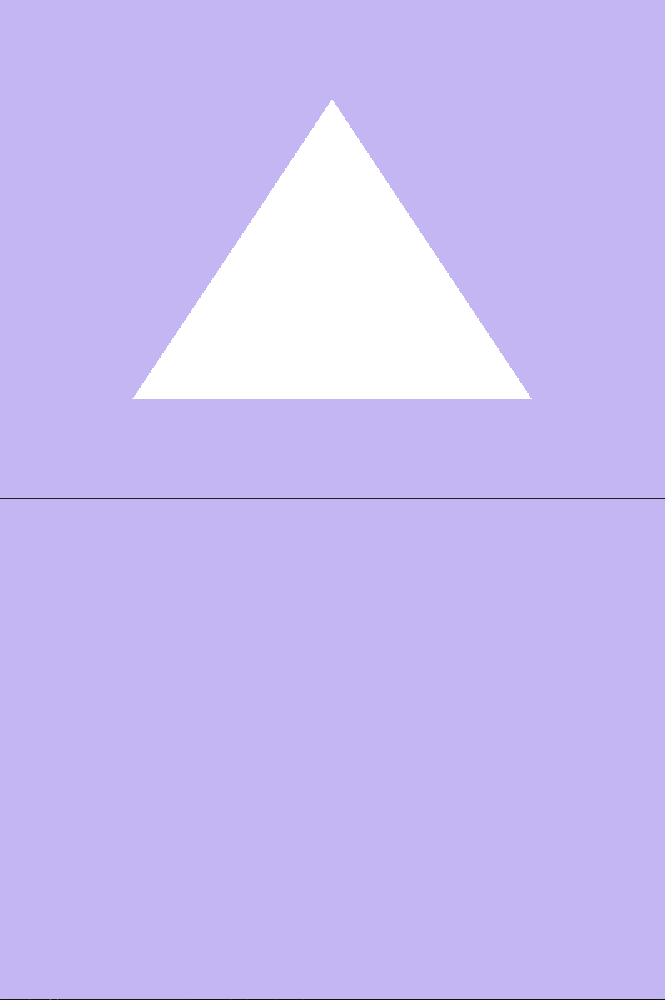

\clearpage
# Task 1

\clearpage
# Task 2

a)

i) The phenominon is called clipping.

ii) Clipping occurs when an object pertrudes outside of the bounds of the clipping box, which in OpenGL is a 2x2x2 rectangle with it's middle in the origin.

iii) The purpose of clipping is to throw away everything that sticks out of the clipping box, so that it doesn't need to be rendered. It also ensures that the objects behind the camera are also not rendered.

\clearpage
b)

{width=9.5cm}

i) The triangle is not rendered.

ii) This happens because the vertices are connected in the wrong order, whih makes the triangle "face" away from the camera, and the back side of the triangle is not rendered.

iii) The normal of the primitive has to face towards the camera lens to be rendered. A way to think about this is to connect the vertices in a counter-clockwise fashion.

\clearpage
c )

i) The deapth buffer has the distance information, which is needed to determine wether fragments have to be drawn or not, based on wether they're obstucted by other objects. What's obstructed or not might change from frame to frame, so that's why it's updated every frame.

ii) A Fragment Shader can be executed multiple times on the same pixel when there are multiple fragments that would occupy that pixel, but the objects that those fragments belong to block each other. Only the fragments of the object in front are shown, but the fragments of the objects behind are also rendered. 

iii) Fragment and Vertex shaders. Fragment shaders are usually responsible for color, while Vertex shaders are usually responsible for positioning and perspective in the scene.

iv) Some vertices can be used to create multiple primitives. Therefore, instead of drawing the same vertex multiple times, we can just reffer to the same one, saving computing power and memory.

v) If/when you have multiple entity types in your buffer.

\clearpage
d )

i) By inverting the X and Y positions, the positions of eaxh vertex will be flipped horizontally and vertically.

ii) In the Fragment shaders main function, a color variable is defined. I changed the values in it to some different color. The color values are RGBA with values ranging from 0 to 1.

{height=15em}